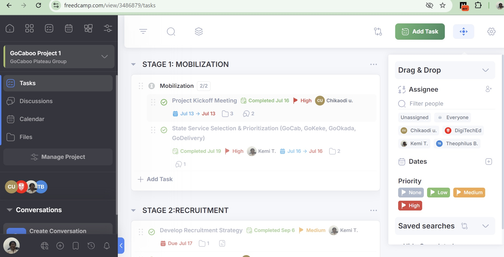
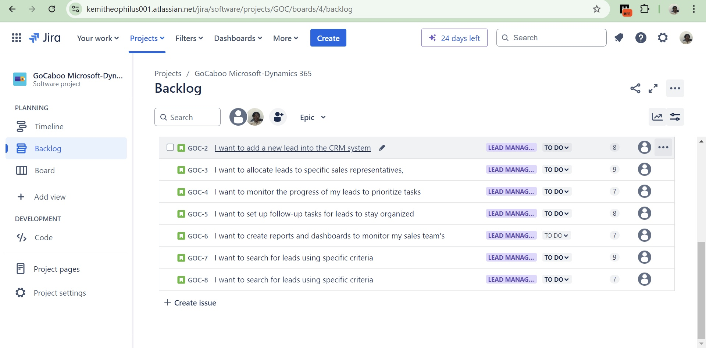

<!--Section 1: Introduce your self-->
## ABOUT ME

I am a dedicated Project Manager with a solid foundation in managing diverse projects, acquired through my experience with GoCaboo.I specialize in helping founders and CEOs achieve their strategic goals by delivering project management solutions that enhance efficiency and drive success.

<!--Mention your top/relevant skills here - core and soft skills-->
My approach focuses on understanding the unique needs of businesses and working collaboratively with teams, leaders, and stakeholders to ensure every project not only meets but exceeds expectations.I thrive in dynamic environments, adept at problem-solving and turning challenges into opportunities for growth.Whether you need a project streamlined, a business process improved, or a vision brought to life, I am here to ensure successful outcomes through careful planning, execution, and communication. My goal is to be a trusted partner to leaders, supporting their mission to innovate and grow.
## My Service

*As a project manager,my focus is on helping founders and CEOs achieve strategic goals by streamlining projects, improving business processes, and driving organizational success.*

**-📊  Resource Allocation & Management.**
Ensuring optimal use of resources time, money, and personnel to maximize project impact and minimize waste. 

**- 📋  Strategic Planning & Execution.**. 
Designing project roadmaps that align with business goals, ensuring clarity, focus, and measurable outcomes that drive revenue growth.

**- ⚠️ Risk Management & Problem Solving.**. 
Identifying potential risks early and developing mitigation strategies, ensuring smooth project execution with minimal disruption.

**- 👥  Team Collaboration & Leadership.**.
Fostering effective communication and collaboration across teams and departments, creating a more productive and motivated workforce.

## Accomplishment
**- ✅ 25%  Collaboration and Communication.**.
Facilitated communication among stakeholders, including sales teams, management, and IT personnel, ensuring all parties remained consistently informed about project progress, resulting in a increase in stakeholder satisfaction.

**- ✅ 30%  Risk Management Rate.**.
I have effectively managed project risks by implementing a proactive risk identification and mitigation process, which has reduced project-related issues . By conducting regular risk assessments, closely monitoring potential threats, and escalating critical issues promptly, I’ve ensured timely intervention and minimized disruptions, contributing to smoother project execution and enhanced stakeholder confidence.

**- ✅ 40% CRM Implementation.**.
Contributed significantly to the successful, on-time implementation of Dynamics 365 Sales, resulting in increased sales team efficiency and improved management of customer data.

<!--Section 2: List 3-4 key projects-->
## MY PORTFOLIO 

*A glimpse of some of GoCaboo Expansion Project I've done.*

**Freedcamp Software.**

Freedcamp has significantly enhanced my ability to manage projects efficiently by offering a centralized platform for collaboration, progress tracking, and task management, resulting in smoother project execution and better outcomes.

**Jira Software.**

Streamlined task management by allowing me to create, assign, and track tasks and issues efficiently,provides detailed dashboards and reports, which give me a real-time overview of project progress, team performance, and potential bottlenecks,create customized workflows which has helped me tailor the process to fit specific project needs. 

[Read More](https://www.linkedin.com/pulse/predictive-modeling-hypothesis-testing-using-titanic-dataset-anietie/)

**ProjectLibre.**

Unfortunately, there weren’t enough lifeboats for everyone onboard, resulting in the death of 1502 out of 2224 passengers and crew. 

<a href="17 How to Present Data to Executives by Anietie Etuk.pdf">Download the Report here (pdf file)</a>

## CONTACT DETAILS

*Let’s connect and see how we can make a difference together!*
<table>
  <tbody>
    <tr>
      <td>📧</td>
      <td><a href="mailto:kemitheophilus001@gmail.com">kemitheophilus001@gmail.com</a></td>
    </tr>
    <tr>
      <td>📞</td>
      <td>(234) 7066632786</td>
    </tr>
    <tr>
      <td>📍</td>
      <td>Jos, Nigeria</td>
    </tr>
    <tr>
      <td>⬇️</td>
      <td><a href="https://etuk123456.github.io/portfolio1/docs/Profile.pdf">Download my CV</a></td>
    </tr>
    <tr>
      <td>🌐</td>
      <td><a href="https://linkedin.com/in/theophiluskemi">The things I do daily on LinkedIn</a></td>
    </tr>
    <tr>
      <td>📺</td>
      <td><a href="https://www.youtube.com/@LearnwithEtuk">Watch my tutorials on YouTube</a></td>
    </tr>
  </tbody>
</table>
